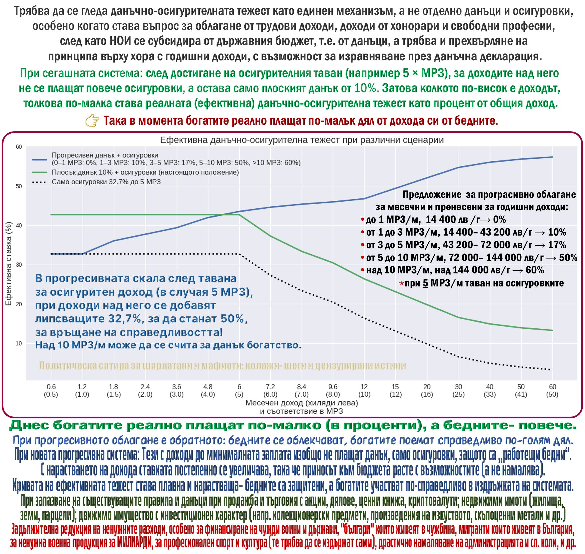

## Най-краткото обяснение

**С плоския подоходен данък бедните пълнят бюджета, а богатите плащат по-малък процент след осигурителния таван.**  
**Виж графиката** - при големи доходи ефективната тежест пада, а при ниски остава висока.  
**Подоходен данък + осигуровки са едно цяло** и трябва да се реформират като един механизъм.

📊 **Графиката (моят анализ и предложение):**

---

## Защо "подоходен данък" и "осигуровки" не са две отделни теми

⚠️ **Данъчно-осигурителната тежест трябва да се гледа като едно цяло.**  
Причината е проста - НОИ се субсидира от държавния бюджет. Това означава, че когато обсъждаме "осигуровки", ние пак обсъждаме бюджет, тоест приходи от данъци. Разделянето е удобна заблуда.

📌 Тук говорим за **общата фискална тежест върху личните доходи от труд** - подоходен данък + осигурителен клин.

*Уточнение: тук не говоря за ДДС и акцизи, а за облагането на личните доходи и осигурителния клин. Не разглеждам и корпоративни, местни и други данъци.*

---

## Къде е проблемът - осигурителният таван + плоският подоходен данък

Сегашният модел има дефект, който не може да бъде оправдан с лозунги:

- До определен доход плащаш подоходен данък + осигуровки.
- След като стигнеш **осигурителния таван** (примерно 5 х МРЗ), за дохода над него **не плащаш повече осигуровки**.
- За тази част от дохода остава **само плоският подоходен данък 10%**.

✅ Следствие, което е чиста математика:  
**колкото по-висок е доходът над тавана, толкова по-ниска става ефективната данъчно-осигурителна тежест като процент от целия доход.**

Тоест - системата става **регресивна** (обратна на справедливото).

---

## Какво точно показва графиката

📌 В графиката има три линии:

- **Зелена** - настоящото положение (плосък подоходен данък 10% + осигуровки до тавана). След тавана ефективната тежест пада.
- **Черна (пунктир)** - само осигуровки до тавана. Показва как след тавана осигуровките "се стопяват" като процент от целия доход.
- **Синя** - прогресивен модел, който **премахва регресията** и прави общата тежест **плавна и нарастваща**.

⚠️ Важна уточняваща дефиниция (за да няма евтини контри):  
Под "осигуровки" тук се има предвид **общият осигурителен клин (работник + работодател)**. Това е реалната цена на труда и реалната тежест върху икономиката - независимо как е разписано по фиш.

---

## Моето предложение - прогресивна система, вързана към МРЗ

✅ Предлагам **подоходният данък + осигуровките** да се третират като един механизъм, а не като две отделни теми.

Принципи:

- Запазваме таван на осигуровките (примерно 5 х МРЗ), за да има предел на осигурителния доход.
- След тавана прогресивният подоходен данък компенсира регресията, така че **ефективната тежест да не пада**, а да расте плавно.
- Всички прагове са вързани към **МРЗ**, за да е **принципно, устойчиво и предвидимо**.
- Добавяме **годишно изравняване** през данъчна декларация, за да няма "вратички" между различни видове лични доходи.

🎯 Целта е проста: **бедните да бъдат защитени, а богатите да участват справедливо в издръжката на системата.**

### Предложение за прогресивно облагане на личните доходи (месечно и годишно изравняване)

Скалата е вързана към МРЗ, за да е **принципна, устойчива и предвидима**:

- до 1 МРЗ/м (до 14 400 лв/г) -> **0%**
- от 1 до 3 МРЗ/м (14 400 - 43 200 лв/г) -> **10%**
- от 3 до 5 МРЗ/м (43 200 - 72 000 лв/г) -> **17%**
- от 5 до 10 МРЗ/м (72 000 - 144 000 лв/г) -> **50%**
- над 10 МРЗ/м (над 144 000 лв/г) -> **60%**

*При 5 МРЗ/м - таван на осигуровките.*

---

## Какво влиза и какво не влиза в тази идея (важно уточнение)

📌 Това предложение е за **лични доходи от труд и приравнени на труд** (заплати, хонорари, свободни професии и сходни форми), с годишно изравняване.

*Не предлагам промяна на съществуващите правила и данъци* при продажба и търговия с:
- акции, дялове, ценни книжа, криптовалути
- недвижими имоти (жилища, земи, парцели)
- движимо имущество с инвестиционен характер (колекционерски предмети, произведения на изкуството, скъпоценни метали и др.)

✅ За останалите приходи в бюджета - **ДДС и акцизи** трябва да са справедливи и разумни, но това е отделна тема (вкл. диференцирано ДДС за базови и здравословни стоки).

---

## Защо това е по-справедливо и по-работещо

- Днес осигурителният таван + плоският подоходен данък правят така, че големите доходи да минават в зона с ниска ефективна тежест.
- При прогресивен модел общата тежест става **плавна и логична** - приносът расте с възможностите, а не пада.
- Това е **справедливо**, **честно**, **морално** и **логично** - и най-важното: видимо в числа, а не в лозунги.

---

## (Допълнение) Разходите на държавата трябва да служат на хората тук

⚠️ Няма смисъл да събираме повече приходи, ако разходите отиват за чужди приоритети и абсурди.

- **задължителна редукция на ненужните разходи**, особено:
  - финансиране на чужди войни и чужди държави
  - програми и разходи за хора, които не живеят и не плащат данъци тук
  - разходи за мигранти, които тежат на системата
  - военна продукция за милиарди без ясен национален интерес
  - държавни пари за професионален спорт и търговска култура (те трябва да се самоиздържат)
  - драстично намаляване на администрацията, служебните автомобили и паразитните структури

✅ **Първо оправяме къщичката тук.**
