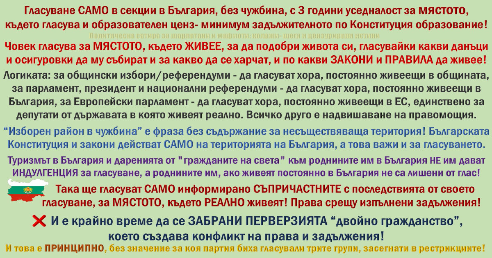

**Човек трябва да гласува за мястото, където реално живее и търпи последствията.**  

Затова настоявам за три принципа:

- **гласуване само в България** (без секции в чужбина)
- **уседналост** 3 години преди избори и референдуми
- **образователен ценз** - минимум задължителното образование
Това не е "наказание".  
Това е здрав разум и справедливост: **правата вървят след задълженията**.

---

## Защо гласуването от чужбина е абсурд

Човек гласува за:
- **данъците и осигуровките**, които ще плаща
- **правилата и законите**, по които ще живее
- **разходите и рестрикциите**, които ще понася като общество
Ако си в чужбина, ти не живееш под последствията тук. Дистанционно има само телевизора.  
**Дистанционно управление на държава не приемам- това е чужда намеса.**

Да, в чужбина има българи, които са свестни. Тук не споря за това. Споря за принципа:  
**гласуването е инструмент за управление на общност, в която живееш.**

---

## Уседналост - минимална защита от чужда намеса

Предлагам **уседналост в България 3 години** преди избори/референдуми.

Идеята е проста:
- оставаш тук
- живееш тук
- плащаш тук
- търпиш последствията тук
- тогава информирано решаваш с гласа си

Да, може да останат "по-малко" гласоподаватели, но **качествени** - съпричастни с последствията.

---

## Образователен ценз - задължителното образование

Искам **образователен ценз** - минимум **задължителното образование** по Конституция, което държавата и данъкоплатците финансират.

Причината:
- ако не можеш да прочетеш и разбереш елементарни правила и текстове
- ставаш лесна жертва на манипулации
- после всички плащаме цената

Това е принципно, не партийно.

---

## Нито електронно, нито дистанционно, нито по пощата

**Нито електронно, нито дистанционно, нито по пощата**, защото:
- не гарантират тайната на вота
- не гарантират свободата на вота (натиск от шеф, кмет, "организатор")
- няма реален контрол, комисия и среда като в секция

Електронен подпис, електронно банкиране и други услуги **нямат нищо общо** с тайната на политическия избор.

---

## Няма "изборен район в чужбина"

Фразата **"изборен район в чужбина"** е фраза без съдържание.  
Българската Конституция и закони действат **на територията на България**.  
"Изборен район в чужбина" е все едно да твърдиш, че имаме област извън границата си, или че си имаме наша колония.

---

## Различни избори - различна общност

Логиката е същата навсякъде:

- за общински избори - да гласуват хора, постоянно живеещи в общината
- за парламент и президент - да гласуват хора, постоянно живеещи в България
- за Европейски парламент - да гласуват хора, постоянно живеещи в ЕС, единствено за депутати от държавата в която живеят реално.

Всичко друго е надвишаване на правомощия.

---

## Още аргументи
ТРЯБВА да се ЗАБРАНИ НАПЪЛНО гласуването в ЧУЖБИНА (това е ЧУЖДА намеса) + уседналост в България 3 години до избори/референдуми + ОБРАЗОВАТЕЛЕН ЦЕНЗ- задължителното по Конституция ОБРАЗОВАНИЕ!  
⚠️ Човек гласува за МЯСТОТО, където ЖИВЕЕ, за да подобри живота си, гласувайки какви данъци да му събират и за какво да се харчат, и по кви ЗАКОНИ и ПРАВИЛА да живее,а ДИСТАНЦИОННО има САМО ТЕЛЕВИЗОРА ми! Така ще гласуват САМО информирано СЪПРИЧАСТНИТЕ с последствията от своето гласуване, за МЯСТОТО, където РЕАЛНО живеят!  
✅В Турция (и не само там) вече са поколения, а дори езика ни НЕ знаят, но иначе отиват на избори, и мерят с клечки, с конци, как да ОБЪРКАТ НАШИЯ ЖИВОТ! Не им ХАРЕСВАЛО да живеят в България, но да ни объркат живота са ПЪРВИ! Правят помен с ЧУЖДА питка!  
👉Примерно Аз НЕ гласувам за избори в САЩ, във Франция, в Германия, и т.н, 
въпреки че МНОГО ПОВЕЧЕ зависи кой ще управлява ТАМ за НАС,
от колкото за ИЗБЯГАЛИТЕ БЕЗРОДНИЦИ от България, кой ще управлява ТУК!  

👉Гласуване, само на мястото, където ВАЖАТ законите ни, вкл изборния, демек САМО в България!  
В чужбина НЕ важат нашите закони и Конституция, поне докато нямаме някоя колония, в която да се гласува! 😆  
ЗАКОНИТЕ (вкл. изборния) и Конституцията на България ВАЖАТ САМО НА ТЕРИТОРИЯТА на България!  

⚠️ Може и 2 милиона да останат с възможност за гласуване, но те реално ще търпят последствията от изборния резултат.  
👉Права (вкл изборни), след като си изпълнят задълженията!  
👉Малко, но качествени гласоподаватели, съпричастни с последствията.  
(На гнилочът му се плаща за да избира ГНИЛОЧ!)  

👉Остава и тия, които избираме да са качествени хора...  
Но при качествени гласоподаватели (истинските ПОТРЕБИТЕЛИ на държавността), няма как и тези които сме си избрали да не работят за КАЧЕСТВО, и за това което иска цвета на нацията, хората с ИНФОРМИРАН избор, които ще търпят последствията от него.  
Казват: каквито гласоподавателите, такива и политиците 😉  
НО за количество на гласоподавателите не се говори 😉  

📌И е крайно време да се ЗАБРАНИ ПЕРВЕРЗИЯТА "двойно гражданство", а при 10 години живот в чужбина, АВТОМАТИЧНО да се отнема, дори да е само българско!  

📌Нито електронно, нито дистанционно гласуване, нито по пощата- при тях няма как да се ГАРАНТИРА тайната на вота! САМО в Изборна секция, САМО в България!  

⚠️Така би протекло електронното и дистанционно гласуване:  
👉От офиса на ШЕФА им, или от кръчмата на КМЕТА? 👉Щото навсякъде има компютри и мобилни телефони, като за поощрение в работата или бира в кръчмата.  
👉Но там НЯМА тайна на вота, НЯМА "тъмна стайчка" НЯМА и КОМИСИЯ, НЯМА и СЪГЛЕДВАЧИ от партии, НЯМА журналисти! 👉Но има ЛЕСНО "купени" ГЛАСОВЕ!  
👉Електронния подпис, електронното банкиране и др. електронни услуги нямат нищо общо с електронното гласуване!  

📌"ИЗБОРЕН РАЙОН В ЧУЖБИНА" - ФРАЗА БЕЗ СЪДЪРЖАНИЕ! Такъв район в България НЯМА (територията ни си има ГРАНИЦА), както е и АБСУРДНО гласуването в чужбина, де! 
Е, ако имахме наши колонии, може би там може да имаме "ИЗБОРЕН РАЙОН В ЧУЖБИНА"... 😆  

✅И понеже НЯМАШЕ лустрация,  
до ДВА мандата на вси изборни ДЛЪЖНОСТИ,  
а за назначения в АДМИНИСТРАЦИЯТА и СЪДЕБНАТА система, само с ОБОСНОВАНА НЕОБХОДИМОСТ, и с конкурс с ясни УСЛОВИЯ и ЗАДЪЛЖИТЕЛНО НОСЕНА ЛИЧНА ОТГОВОРНОСТ!  
Аман от КОЛЕКТИВНО БЕЗХАБЕРИЕ!  

📌ТОВА го намирам за ПРИНЦИПНО и СПРАВЕДЛИВО, без значение за коя партия гласуват от чужбина или неграмотните!  

⚠️Глобалната икономика НЕ плаща, НИТО БЕЗОБРАЗИЯТА на ПОЛИТИЦИ, СЪДЕБНА СИСТЕМА и АДМИНИСТРАЦИЯ, нито ПЕНСИИ, ЗДРАВЕ, ОТБРАНА, СИГУРНОСТ и вси ОБЩЕСТВЕНИ УСЛУГИ в България, както и държавните дългове (теглени от ИЗБРАНИТЕ правителства), а тия, дето сме останали ТУК!  
⚠️Тоя МИТ, че ХЪШОВЕТЕ били най- големия "ИНВЕСТИТОР", е ФАЛШИВА "новина"- парите от "РОДОЛЮБИВИТЕ" БЕЖАНЦИ, влизащи в България, са ДАРЕНИЯ към роднини, около 1% от БВП, и ОБИКНОВЕНО тъпчат баМковите сметки на роднините им, НО те ОБИКНОВЕНО са се регистрирали за ПОМОЩИ, ПЛАЩАНИ от ДАНЪКОПЛАТЦИТЕ в България!  
⚠️ НИКОЙ НЕ ги е ГОНИЛ! Казва се ЛИЧЕН ИЗБОР и той носи ПОСЛЕДСТВИЯ! Явно в България НЕ са могли да се реализират и са напуснали НЕДОВОЛНИ за няколко кинта повече, да лъскат т. чинии и да перат л. чаршафи 😅  
⚠️Заради ТЯХНОТО отсъствие в България, НИВАТА на пенсиите са на това МИЗЕРНО положение!   Щото пенсионната ни система (както и здравната) е солидарна- работещите ПЛАЩАТ за неработещите, И заради ТЯХ ще се пенсионираме на по 100 години, някога!  
⚠️А ПОТРЕБЛЕНИЕТО е САМО ЛИЧНО- демек "гражданите на света" са ПОТРЕБИТЕЛИ, като всички останали ЧУЖДЕСТРАННИ ТУРИСТИ, дошли в България за отпуската си, или да си правят зъбите, или когато им пращат лютеница!  
⚠️Иначе ИМУЩЕСТВЕНИ данъци (като за ИМОТИ и КОЛИ), плащат ВСИЧКИ във ВСЯКА община в която са РЕГИСТРИРАНИ, и това е ЗА ВСЕКИ имащ такова ИМУЩЕСТВО, независимо от ГРАЖДАНСТВОТО, да не говорим, че НИКОЙ не задължава НИКОГО да има ВАКАНЦИОНЕН ИМОТ!  
⚠️Иначе и ние ТУК ДАРЯВАМЕ, но СЛЕД като си платим ДАНЪЦИТЕ и ОСИГУРОВКИТЕ, от това, че РАБОТИМ в НАШАТА ИКОНОМИКА с ЛИЧЕН ТРУД!  
⚠️И даренията на "гражданите на света" към роднините им не им дава индулгенция за гласуване за ЧУЖД ЖИВОТ, в ЧУЖДА КЪЩА!  

⚠️Странно е, че "гражданите на света", няма да се върнат в България да ИЗЖИВЕЯТ ПОСЛЕДСТВИЯТА от СВОЯ ИЗБОР (ДОКАЗАНО❗ след последните избори от години назад ‼️), дори НЯМА ДА ПЛАТЯТ БЕЗОБРАЗИЯТА на своите избраници, но пък ДИСТАНЦИОННО ни казват как ние ТУК да живеем, а ние да плащаме и за ТЕХНИТЕ ПРИЩЕВКИ! НАГЛИ ДО БЕЗОБРАЗИЕ!  

📌ЗАКОНИТЕ (вкл. изборния) и Конституцията на България ВАЖАТ САМО НА ТЕРИТОРИЯТА на България!  
⚠️И да, ДАНЪКОПЛАТЦИТЕ в България ПЛАЩАТ и СЕКЦИИТЕ в ЧУЖБИНА и в последствие СУБСИДИЯ за ВСЕКИ ТЕХЕН ГЛАС, което е ПОРЕДНИЯ АБСУРД,  
ЗА ХЪШОВЕ-БЕЗРОДНИЦИ, които НЕ са съпричастни с ПОСЛЕДСТВИЯТА от своя глас!
⚠️Как се разследва купуването на гласове в ЧУЖБИНА, примерно в Турция, в ДжундъроБритания, в Германия?  
А, да- НИКАК! В ЧУЖБИНА не важат нашите закони, освен тоя за гласуване, което е АБСУРДНО, щото законите ни ВАЖАТ САМО на територията на България, вкл и изборния!  
⚠️В ЧУЖБИНА имаше ли видеонаблюдение (и в Турция)?  

📌Искат НЯКОЙ ДРУГ да оправи държавата ни, НО и за наша сметка, за да могат да ваканцуват на чисто и спретнато място! ДА, обичат ВСИЧКО да им е БЕЗПЛАТНО, да имат САМО права, БЕЗ НИКАКВИ ЗАДЪЛЖЕНИЯ!  
Чуждестранни туристи, сър! Някой даже знаят езика ни!  

❓Интересно за парламента в КОЧИНАТА ЕгС гласуват САМО с уседналост ТАМ, а за български парламент гласуват от всякъде, дори и хора, които НЕ са родени в България, значи направо да разрешим на целия свят да гласува в нашите избори, за да се знае кви сме ПРОДАЖНИЦИ,  
❓и второ: тези с двойното гражданство, примерно живеещи в Германия, дали гласуват един път с българското си гражданство за български евродУпЕтат, и после за евродУпЕтат от второ, че даже и от трето гражданство? За колко евродУпЕтата въобще може да гласува?!? Що за ПЕРВЕРЗИЯ е двойното гражданство?!?  

📌НАПЪЛНО съм съпричастен с думите на Джоко Росич при Чалгара- ЧУЖДОПОКЛОННИК.  
Това видео е подходящо като **урок по патриотизъм** и като огледало за темата за хората, които напускат България, а после искат права и отношение "от дистанция" към държава, която **местните са изградили**.:  


---

## Свързани статии
- [Образование - подарък или инвестиция, която някой дължи обратно](/statii/obrazovanie/obrazovanie-dar-ili-investicia/)
- [Училища в чужбина за наша сметка - моралният и бюджетният абсурд](/statii/demografiya/uchilishta-v-chuzhbina-za-nasha-smetka/)
- [Гражданство - същност, двойно гражданство и заличаване след 10 години](/statii/demografiya/grazhdanstvo-dvoyno-zalichavane-10-godini/)

