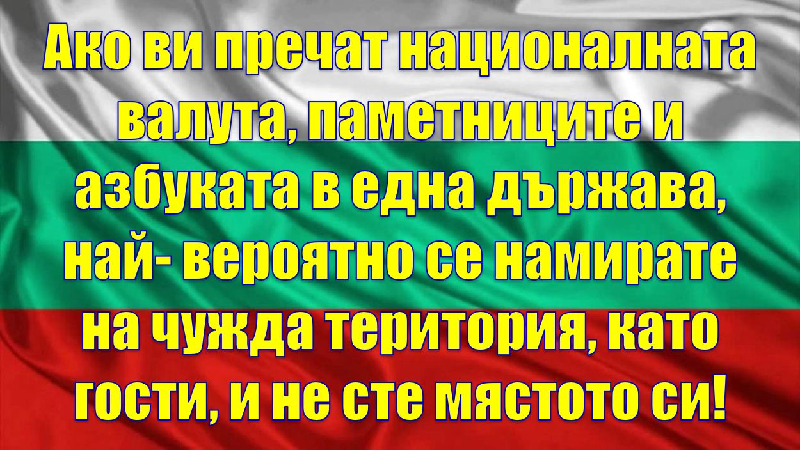

**Съд за вандалите и техните подбудители**, унищожаващи паметници- при това брутално и незаконно. Премахването на паметници с демонстративно рушене е **престъпление** и поредно безобразие по заличаване на историята.

## Цивилизация или варварство
⚠ По какво се различават цивилизованите държави от варварските и колонизираните държави?  
Първите **не рушат** паметниците и историята си.  
Вторите искат да имат **чужда история** - обикновено на своите господари, или просто не разбират какво вършат, чупейки паметници и фалшифицирайки историята.

Паметниците не са само камък и метал. Те са **памет*- и като общество нямаме право да я трошим с флекс и багер. Историята не се "поправя" с чукове.

## Когато рушиш паметници, рушиш и идентичност
👉 Две световни войни- и заради продажни политици влизаме винаги в тях, и винаги на погрешната страна, винаги с лоши последствия, вместо да сме неутрални.  
И сега отново повтаряме същата грешка, защото пак управляват продажници, които искат да се харесат на господарите си.

👉 И понеже не им харесва историята, искат да я разрушат и фалшифицират- първо под формата на паметник, после паметници, после улици и всичко останало, за да заличат нашата **национална идентичност**, заличавайки историята ни.

👉 На господарите на нашите управници не им трябва независима държава с история, обичаи, традиции и т.н. Трябва им територия - погранична, ползвана като инструмент и плацдарм.

## Двойни стандарти и удобна амнезия
👉 Иначе се сърдим, когато във фалшивата държава Македония се рушат наши паметници от разни вандали.  
👉 Абсурдно е да се рушат паметници. **Думичката "паметник" идва от думата "памет"**.

В случая говорим за памет за загиналите във войната срещу нацизма, а историята- харесва ли ни или не- не се отменя с резачка. Ако някой има спор с интерпретацията- има музеи, табели, контекст, образование. Не разруха.

## Световният урок - какво правят варварите с паметта
Ако някой си мисли, че "русенето на паметници" е модерно, демократично или "европейско", да погледне какво се случва, когато варварството реши да води културна политика.

Преди години в Близкия изток, по време на войни, бяха унищожавани древни паметници и произведения на изкуството, правени преди хилядолетия - не защото били опасни, а защото били **памет**.  
Има примери като:
- разрушения на античния град Палмира в Сирия
- унищожаване на артефакти в музея в Мосул (Ирак)
- разрушения на древни обекти като Нимруд и Хатра (Ирак)

Това е същият принцип: **когато не можеш да управляваш с морал и разум, управляваш с разрушаване на паметта**. Който троши миналото, подготвя да троши и настоящето.

## Какво е нормалното решение
1) **Паметниците не се рушат.** Ако се местят- става законно, прозрачно, с проект, експертиза, обществен дебат и ясна отговорност.  
2) Ако има спор за смисъла - добавят се **контекст и табели**, музейни решения, образователни материали.  
3) **Съд и отговорност**- не само за “изпълнителя с флекса”, а и за подбудителите и поръчителите.  
4) Защита на културното наследство като принцип - защото утре “неудобен” може да стане всеки друг паметник.

## Германия като пример - историята не се трие с чукове
По спомен и по логика на цивилизацията: в Германия не се тръгва да се руши "каквото не ни харесва", за да изглеждаме добри пред някого. Те нямат "носталгични" паметници, които да възхваляват нацизма, но не заличават следите от миналото си. Оставят ги като **свидетелства** и ги превръщат в **урок**- музеи, документационни центрове, контекст, образование.

Точно това е разликата между държава с гръбнак и държава на подлоги: едната учи поколенията с факти, а другата троши камък, за да се хареса на господарите си.

И още нещо показателно: Германия поддържа и съветските военни мемориали, защото паметта за войната и жертвите не се решава с флекс. Историята може да е тежка, но **не се лекува с вандализъм**.

## Финал
Паметта не е политически сезонен продукт. Днес рушат един паметник, утре друг, после улици, после учебници, после език и идентичност.  
Който иска да е цивилизована държава - **пази историята си**, не я троши.